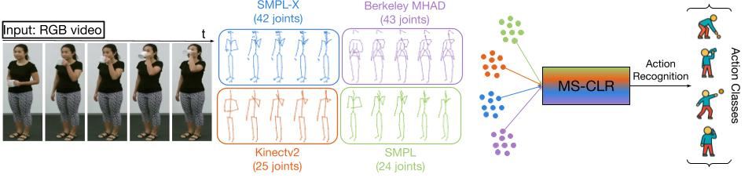

# MS-CLR 
[![CC BY-NC-SA 4.0][cc-by-nc-sa-shield]][cc-by-nc-sa]

This is an official PyTorch implementation of **"MS-CLR: Multi-Skeleton Contrastive Learning for Human Action Recognition"**. 



## Requirements
      

## Data Preparation
- Download the raw data of [NTU RGB+D](https://github.com/shahroudy/NTURGB-D).
- Extract additional skeleton sequences by running `pose_extraction.py`. The pose extractor we use is [MeTRAbs](https://github.com/isarandi/metrabs). Download their model from the repository and place it in `metrabs_pytorch/models`. Follow their instructions for downloading additional dependencies.
- For the NTU RGB+D dataset, preprocess data with `tools/ntu_gendata.py`.
- Then downsample the data to 50 frames with `feeder/preprocess_ntu.py`.

## Installation
  ```bash
# Install torchlight
$ cd torchlight
$ python setup.py install
$ cd ..
  
# Install other python libraries
$ pip install -r requirements.txt
  ```

## Unsupervised Pre-Training

Example for unsupervised pre-training of **3s-MS-AimCLR**. You may need to change some settings of `.yaml` files in `config/ntu60/pretext` folder.
```bash
# train on NTU RGB+D xview joint stream
$ python main.py pretrain_aimclr --config config/ntu60/pretext/pretext_aimclr_xview_joint.yaml

# train on NTU RGB+D xview motion stream
$ python main.py pretrain_aimclr --config config/ntu60/pretext/pretext_aimclr_xview_motion.yaml

# train on NTU RGB+D xview bone stream
$ python main.py pretrain_aimclr --config config/ntu60/pretext/pretext_aimclr_xview_bone.yaml
```

## Linear Evaluation

Example for linear evaluation of **3s-MS-AimCLR**. You may need to change `.yaml` files in `config/ntu60/linear_eval` folder.
```bash
# Linear_eval on NTU RGB+D xview
$ python main.py linear_evaluation --config config/ntu60/linear_eval/linear_eval_aimclr_xview_joint.yaml

$ python main.py linear_evaluation --config config/ntu60/linear_eval/linear_eval_aimclr_xview_motion.yaml

$ python main.py linear_evaluation --config config/ntu60/linear_eval/linear_eval_aimclr_xview_bone.yaml
```

## Performance

For three-streams results, you can train three separate models and ensemble the results, or you can use three models in one `.py` file, similar to `net/crossclr_3views.py`.

For multi-skeleton ensembling, use the `ensemble_feeder` during linear evaluation and set the `ensemble` parameter to true during model initialization.

|     Model     | NTU 60 xsub (%) | NTU 60 xview (%) |
| :-----------: | :-------------: | :--------------: |
| MS-AimCLR-joint  |      76.1      |      83.0       |
| MS-AimCLR-motion |      73.1      |      80.4       |
|  MS-AimCLR-bone  |      76.1      |      82.2       |
|   3s-MS-AimCLR   |    80.9    |  86.7     |
|   3s-MS-AimCLR +   |    **88.0**    |  **94.2**     |

Here "+" indicates our multi-skeleton ensemble method.

## License
This work is licensed under a
[Creative Commons Attribution-NonCommercial-ShareAlike 4.0 International License][cc-by-nc-sa].

[cc-by-nc-sa]: http://creativecommons.org/licenses/by-nc-sa/4.0/
[cc-by-nc-sa-image]: https://licensebuttons.net/l/by-nc-sa/4.0/88x31.png
[cc-by-nc-sa-shield]: https://img.shields.io/badge/License-CC%20BY--NC--SA%204.0-lightgrey.svg

## Acknowledgement
The framework of our code is extended from the following repositories. We sincerely thank the authors for releasing the codes.
- The framework of our code is based on [CrosSCLR](https://github.com/LinguoLi/CrosSCLR) and [AimCLR](https://github.com/Levigty/AimCLR).
- The encoder is based on [ST-GCN](https://github.com/yysijie/st-gcn/blob/master/OLD_README.md).
- The pose extractor used is [MeTRAbs](https://github.com/isarandi/metrabs).
